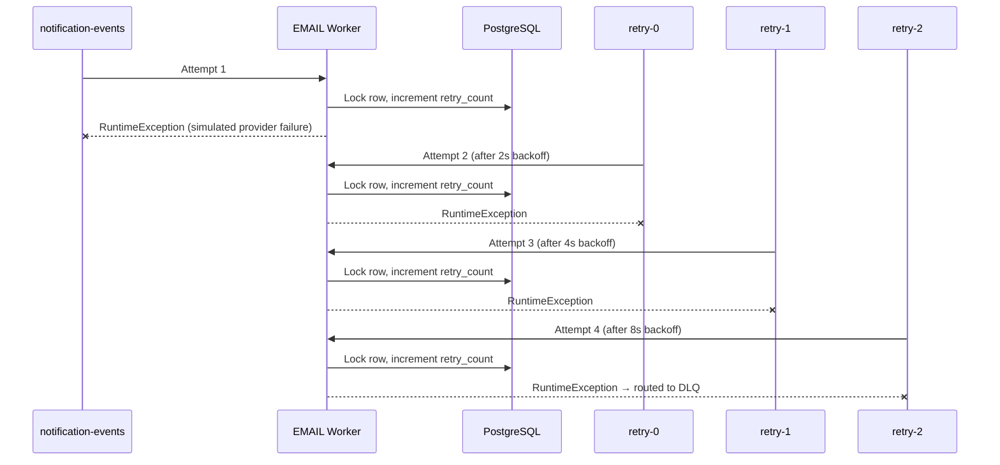
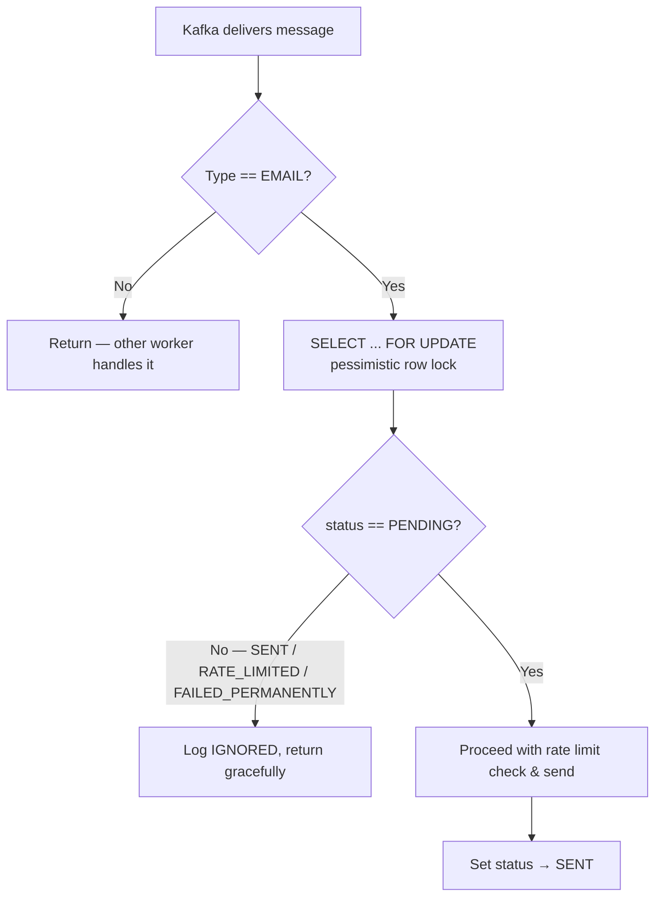
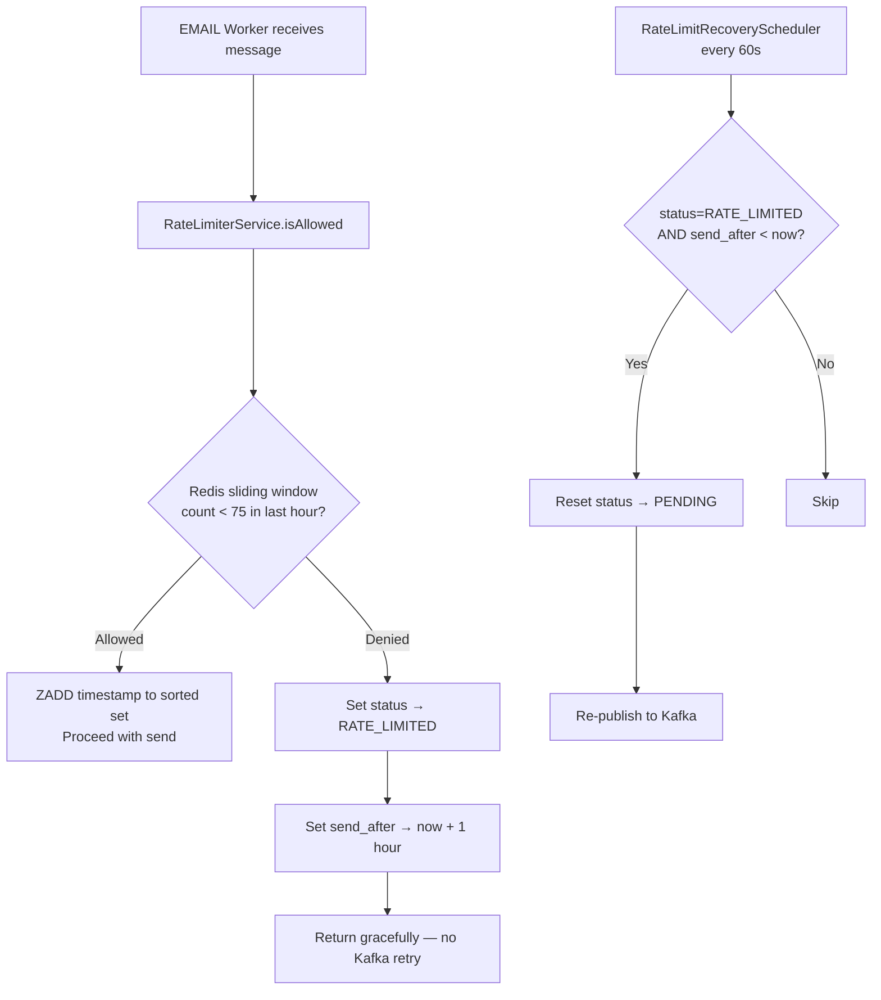

# Notification Platform

A production-style, event-driven notification platform with scalable System Design Components

---

## What This Project Demonstrates

| Concept | Implementation |
|---------|----------------|
| **Event-driven architecture** | HTTP ingress → PostgreSQL → Kafka fan-out → channel workers |
| **Fault tolerance** | Non-blocking Kafka retry topics with exponential backoff + DLQ |
| **Idempotency** | PostgreSQL pessimistic row locking + status gate |
| **Rate limiting** | Redis sliding-window (Lua script) with deferred requeue |
| **Observability** | Structured JSON logs, custom Micrometer metrics, Prometheus + Grafana |
| **Load validation** | k6 constant-arrival-rate test against the full EMAIL path |

**Stack:** Spring Boot 4.1 · Java 23 · PostgreSQL · Apache Kafka (KRaft) · Redis · Prometheus · Grafana

---

### Request Lifecycle (Happy Path)

1. **Ingress** — `POST /notifications` persists the notification (`PENDING`) and publishes to Kafka with a `trace_id` header.
2. **Preference check** — If the user has disabled the channel, status becomes `SKIPPED` and nothing is published.
3. **Fan-out** — A single topic (`notification-events`) feeds three independent consumer groups (EMAIL, SMS, PUSH), each filtering by `type`.
4. **EMAIL worker** — Acquires a DB row lock, checks idempotency, enforces rate limits, simulates provider send, and marks `SENT`.
5. **Recovery** — Rate-limited messages are deferred for 1 hour, then re-published by a scheduled job.

---

## Kafka Topics

| Topic | Partitions | Created By | Purpose |
|-------|------------|------------|---------|
| `notification-events` | 3 | `KafkaTopicConfigurator` | Main ingress topic for all notification types (EMAIL, SMS, PUSH) |
| `notification-events-retry-0` | auto | Spring `@RetryableTopic` | 1st retry after EMAIL worker failure |
| `notification-events-retry-1` | auto | Spring `@RetryableTopic` | 2nd retry |
| `notification-events-retry-2` | auto | Spring `@RetryableTopic` | 3rd retry |
| `notification-events-dlq` | auto | Spring `@RetryableTopic` | Dead letter queue — terminal failures after all attempts |

### Consumer Groups

| Worker | Group ID | Concurrency | Topics Consumed |
|--------|----------|-------------|-----------------|
| EMAIL | `email-worker-group` | 3 | `notification-events` + retry/DLQ (via framework) |
| SMS | `sms-worker-group` | 3 | `notification-events` |
| PUSH | `push-worker-group` | 3 | `notification-events` |

---

## Retry Flow

The EMAIL worker uses Spring Kafka's **non-blocking retry topics** (`@RetryableTopic`). Failures are routed to dedicated retry topics instead of blocking the main consumer thread.



| Parameter | Value |
|-----------|-------|
| Total attempts | **4** (1 initial + 3 retries) |
| Initial backoff | **2 seconds** |
| Backoff multiplier | **2.0×** → delays of 2s, 4s, 8s |
| Retry topic suffix | `-retry-{index}` |
| Failure trigger | Simulated random provider failure (`Random().nextBoolean()`) |

**Key design choice:** `@Transactional(noRollbackFor = RuntimeException.class)` ensures the DB `retry_count` increment **persists** even when the exception is thrown for Kafka retry routing.

---

## DLQ Flow

When all 4 attempts are exhausted, Spring Kafka automatically forwards the message to `notification-events-dlq`, where `@DltHandler` performs terminal processing.

| Step | Action |
|------|--------|
| 1 | Message arrives on `notification-events-dlq` after 4 failed attempts |
| 2 | `processDltMessage()` reads `trace_id` from Kafka headers for log correlation |
| 3 | Micrometer counter `notifications_dlq_total{type="EMAIL"}` is incremented |
| 4 | Notification status is set to **`FAILED_PERMANENTLY`** in PostgreSQL |
| 5 | Final `retry_count` is logged for post-mortem analysis |

This is a **terminal state** — there is no automatic replay. In production, this would typically trigger alerting and a manual replay tool.

---

## Idempotency Flow

Duplicate delivery is prevented using **PostgreSQL pessimistic locking** and a **status gate** — no separate idempotency store (Redis) is needed.



| Aspect | Detail |
|--------|--------|
| **Idempotency key** | Notification `id` (PostgreSQL primary key) |
| **Concurrency control** | `@Lock(PESSIMISTIC_WRITE)` via `findByIdForUpdate()` |
| **Duplicate detection** | Only `PENDING` rows are processed; all other statuses are ignored |
| **Scope** | EMAIL worker only (SMS/PUSH are simplified stubs) |

If two consumer threads receive the same message simultaneously, Thread B **blocks** on the row lock until Thread A completes, then sees a non-`PENDING` status and exits without re-processing.

---

## Rate Limiting Flow

Rate limiting is enforced at **egress** (inside the EMAIL consumer), not at the API layer. This protects downstream email providers from being overwhelmed while still accepting all ingress requests.



### Algorithm: Redis Sliding Window (Lua Script)

| Setting | Value |
|---------|-------|
| **Limit** | 75 requests per user per hour |
| **Redis key** | `rate_limit:user:{userId}` |
| **Data structure** | Sorted Set (score = timestamp) |
| **Atomicity** | Single Lua script: prune old entries → count → add if under limit |
| **Key TTL** | 3600 seconds |

**Why defer instead of drop?** Rate-limited messages are persisted with `send_after` and re-queued by `RateLimitRecoveryScheduler` — no data loss, just delayed delivery.

### Redis Insight — Rate Limit Keys Under Load


---

## Load Test Results (k6)

### Test Configuration

| Setting | Value |
|---------|-------|
| **Tool** | [k6](https://k6.io/) |
| **Scenario** | `egress_rate_limit_test` |
| **Executor** | `constant-arrival-rate` |
| **Rate** | 25 requests/second |
| **Duration** | 30 seconds (~750 total requests) |
| **Users** | 5 (`user_1` … `user_5`, randomly selected) |
| **Type** | EMAIL |
| **Endpoint** | `POST http://localhost:8888/notifications` |

```bash
k6 run k6/load-test.js
```

### Expected Behavior

With 750 requests spread across 5 users (~150/user) and a limit of **75/user/hour**, roughly half of each user's requests are accepted and half are rate-limited — validating the sliding-window enforcement under sustained load.

### Grafana Metrics Dashboard

Prometheus scrapes `/actuator/prometheus` every 5 seconds. Custom business metrics exposed:

| Metric | Type | Description |
|--------|------|-------------|
| `notifications_sent_total{type="EMAIL"}` | Counter | Successful email deliveries |
| `notifications_failed_total{type="EMAIL"}` | Counter | Simulated provider failures (triggers retry) |
| `notifications_dlq_total{type="EMAIL"}` | Counter | Messages that reached DLQ |
| `retry_count{type="EMAIL"}` | Summary | DB retry count per failure |


---

## API

| Method | Path | Description |
|--------|------|-------------|
| `POST` | `/notifications` | Accept and publish a notification |
| `GET` | `/actuator/health` | Health check |
| `GET` | `/actuator/prometheus` | Prometheus metrics scrape endpoint |

**Request body:**

```json
{
  "userId": "user_1",
  "type": "EMAIL",
  "message": "Hello from the notification platform!"
}
```

---

## Getting Started

### Prerequisites

- Java 23
- Docker & Docker Compose
- [k6](https://k6.io/docs/get-started/installation/) (optional, for load testing)

### Run Infrastructure

```bash
docker compose up -d
```

| Service | URL |
|---------|-----|
| PostgreSQL | `localhost:15432` |
| Kafka | `localhost:9092` |
| Redis | `localhost:6379` |
| Redis Insight | `http://localhost:8001` |
| Prometheus | `http://localhost:9090` |
| Grafana | `http://localhost:3000` |

### Run the Application

```bash
./mvnw spring-boot:run
```

The app starts on **port 8888**. Flyway migrations run automatically on startup.

### Send a Test Notification

```bash
curl -X POST http://localhost:8888/notifications \
  -H "Content-Type: application/json" \
  -d '{"userId":"user_1","type":"EMAIL","message":"Hello!"}'
```

---

## Notification Status Lifecycle (EMAIL)

```
PENDING ──→ SENT                         (successful delivery)
PENDING ──→ RATE_LIMITED ──→ PENDING     (deferred 1 hr, then re-queued by scheduler)
PENDING ──→ FAILED_PERMANENTLY           (DLQ after 4 failed attempts)
PENDING ──→ SKIPPED                      (user preference disabled, at API layer)
```

---

## Key Design Decisions & Trade-offs

1. **Single topic, multiple consumer groups** — Simplifies publishing; each channel worker filters by `type`. Trade-off: all workers read every message (filtered early in code).
2. **Idempotency via DB lock, not Redis** — Leverages existing PostgreSQL state; no extra store to manage. Trade-off: lock contention under very high concurrency on the same notification ID.
3. **Egress rate limiting, not ingress** — API accepts all requests; the consumer enforces provider limits. Trade-off: DB and Kafka absorb burst traffic; rate-limited messages are deferred, not rejected.
4. **Non-blocking Kafka retries** — Retry topics keep the main consumer unblocked. Trade-off: more topics to manage; Spring handles creation automatically.
5. **Simulated failures** — Random 50% failure rate on EMAIL sends exercises the full retry → DLQ path without a real provider dependency.

---

## Project Structure

```
src/main/java/com/project/notification_service/
├── config/          KafkaConfig, KafkaTopicConfigurator
├── controller/      NotificationController
├── entity/          Notification, UserPreference
├── repository/      NotificationRepository (with pessimistic lock query)
├── service/         NotificationConsumer, NotificationProducer,
│                    RateLimiterService, RateLimitRecoveryScheduler, PreferenceService
└── utility/         JacksonSerializer, JacksonDeserializer
```
